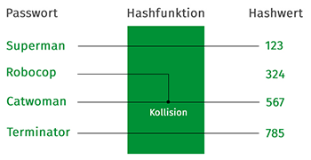

# Das Verfahren von Hashing

Bevor jedoch mit dem Verfahren um _Consistent Hashing_ begonnen wird, wollen wir zunächst erklären, was _Hashing_ bzw. _Hashfunktion_ überhaupt ist. Eine Hashfunktion ist eine Abbildung von der Eingabe einer beliebigen Menge, auf eine kleinere Zielmenge, auch _Hashwert_ genannt. _Speziell in der Informatik verwendet man auch den Begriff Hash-Algorithmus (englisch hash algorithm), da Hashfunktionen oftmals in Form eines Algorithmus statt einer mathematischen Funktion spezifiziert werden._<sup>1</sup> Es ist erwünscht, dass bei unterschiedlichen Eingaben, auch unterschiedliche Ausgaben bzw. _Hashwerte_ entstehen, sonst kann es zu einer _Kollision_ kommen. Kollisionen treten dann auf, wenn durch *unterschiedliche* Eingaben, *gleiche* _Hashwerte_ entstehen. Jedoch für bekannte und beschränkte Eingabemöglichkeiten können perfekte bzw. Kollisionsfreie Hashfunktionen gefunden werden.  

Mit dem folgenden Beispiel wollen wir es deutlicher beschreiben.  

  
Abb. 1 Hashfunktion

Auf dem Bild auf der linken Seite sind vier verschiedene Passwörter angegeben. Diese durchlaufen eine _Hashfunktion_, und werden in diesem Fall dadurch auf eine feste Länge von drei Zeichen von Zahlen reduziert, zB. "Superman" wird als "123" gespeichert. Bei zwei verschiedenen Passwörtern, können wir auch eine Kollision sehen. Dabei bedeutet es, dass nach der Hashfunktion, beide Passwörter die gleiche Zeichenfolge aufweisen.  

Die Hashfunktion bzw. Hash-Algorithmus kann beliebig gewählt werden. Dabei wird die Eingabe beliebiger Länge, wie zB. ein Passwort in eine Ausgabe fester Länge, in unserem Beispiel auf drei Zeichen, reduziert. Dadurch entsteht eine einheitliche und kompakte Form.  

## Hashwert  

Das Ergebnis einer Hashfunktion bzw. Hash-Algorithmus ist der Hashwert. Dabei kann festgelegt werden, auf wieviele Zeichnen das Ergebnis reduziert wird. In den meisten Fällen wird die Eingabe als ein hexadezimal Wert kodiert. In den oberen Beispiel ist es zB “123”, ein anderer Hashwert einer anderen Hashfunktion könnte auch “2A35b823de” sein.  

## Eigenschaften  

Eine Hashfunktion sollte die folgenden Eigenschaften haben:  

* Einwegfunktion:  
Es ist wichtig, dass die Hashfunktion immer den gleichen Hashwert liefert, es jedoch nicht möglich sein soll, aus dem Hashwert die Ursprungsangabe auszurechnen.  

* Kollisionssicherheit:  
Wie in unserem Beispiel zu sehen, ergeben die Passwörter “Catwoman” und “Robocop” den gleichen Hashwert. In den meisten Fällen ist dieses Verhalten nicht erwünscht. Falls eine Hashfunktion nicht den gleichen Hashwert für unterschiedliche Eingaben liefert, wird diese Hashfunktion als eine kryptografische Hashfunktion genannt und damit die Kollisionssicherheit garantiert.  

* Schnelligkeit:  
Die Berechnung des Hashwerts soll so schnell wie möglich erfolgen.  
____  
[Zurück](02_Geschichte.md) | [Weiter](04_Anwendungsfelder.md)  

____
```
1. https://de.wikipedia.org/wiki/Hashfunktion
```
